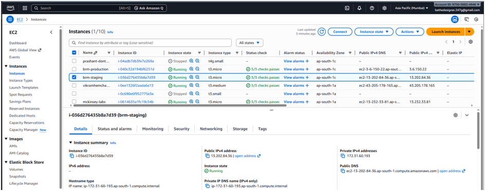
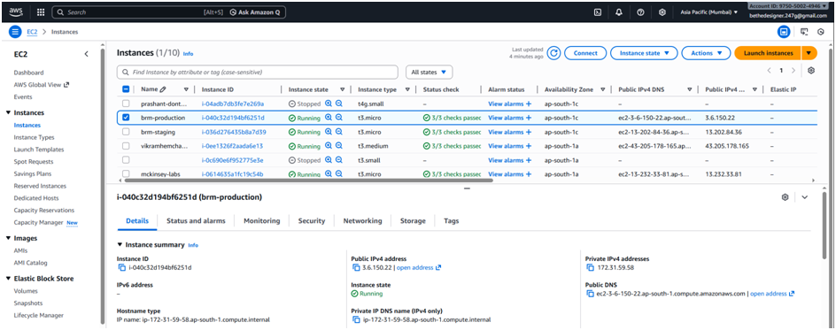
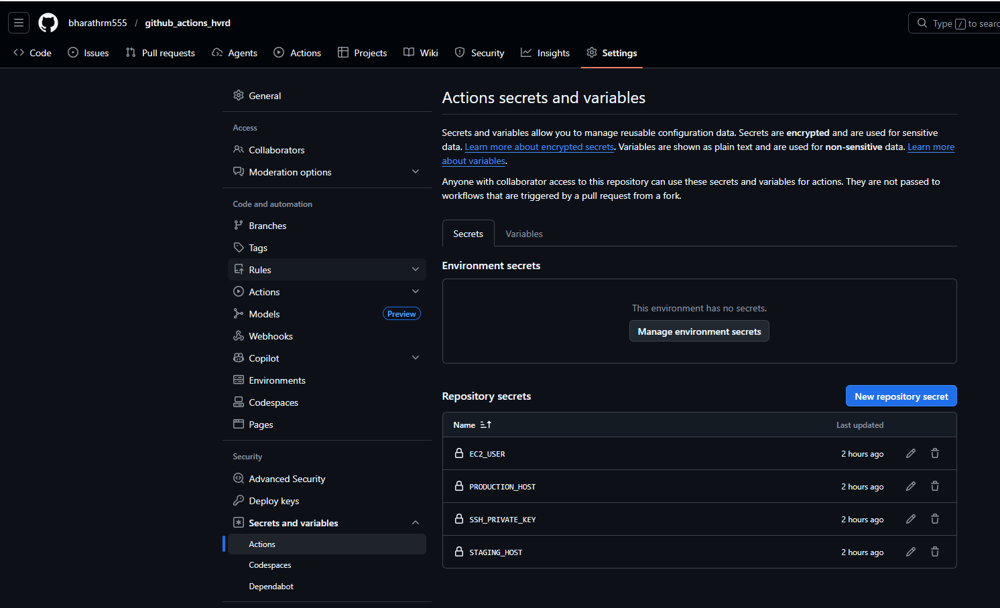
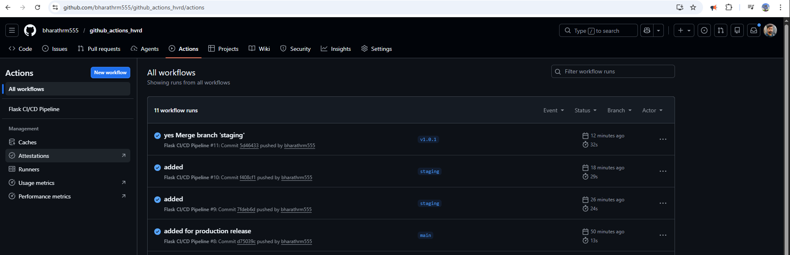
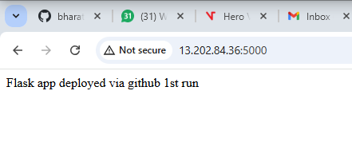
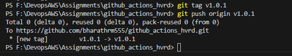
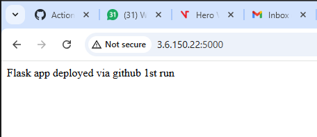

Deploying to staging and production servers from github actions

1. Create two ec2 instances
    a. brm-staging
    b. brm-production
    c. security groups allowing 22, 80, 5000 from all

2. Install on each ec2

    sudo apt update
    sudo apt upgrade -y
    sudo apt install python3 python3-pip git -y
    sudo apt install python3-venv -y

    sudo nano /etc/systemd/system/flask-app.service

        Added Configuration

        [Unit]
        Description=Flask App
        After=network.target

        [Service]
        User=ubuntu
        WorkingDirectory=/home/ubuntu/flask-app
        ExecStart=/home/ubuntu/flask-app/venv/bin/python app.py
        Restart=always

        [Install]
        WantedBy=multi-user.target

3. Enable the system services
    sudo systemctl daemon-reload
    sudo systemctl enable flask-app
    sudo systemctl start flask-app

4.  give sudo permissions

    sudo visudo
    #add these lines
    ubuntu ALL=(ALL) NOPASSWD:ALL

5. Setting secrets for the github

    goto repo - settings - secrets and variables - actions ..... and add these secrets
    EC2_USER = UBUNTU
    PRODUCTION_HOST = PUBLIC IP OF THE PRODUCTION SERVER
    STAGING_HOST = PUBLIC IP OF THE STAGING SERVER
        generate a key pair from you local machine
        ssh-keygen -t rsa -b 4096 -C "github-actions"
    SSH_PRIVATE_KEY = paste the private key here and the public key in the ec2 server in the ~/.ssh/authorized_keys

5. To release to the staging

    Just push the codes to the staging branch and it will deploy.

6.  But to deploy to the production server

    We need to merge the staging with the main branch and add the tags and then the cicd pipeline will trigger automatically based on our production stage logic from the cicd pipeline

    git checkout main
    git merge staging
    git tag v1.0.0
    git push origin v1.0.0

